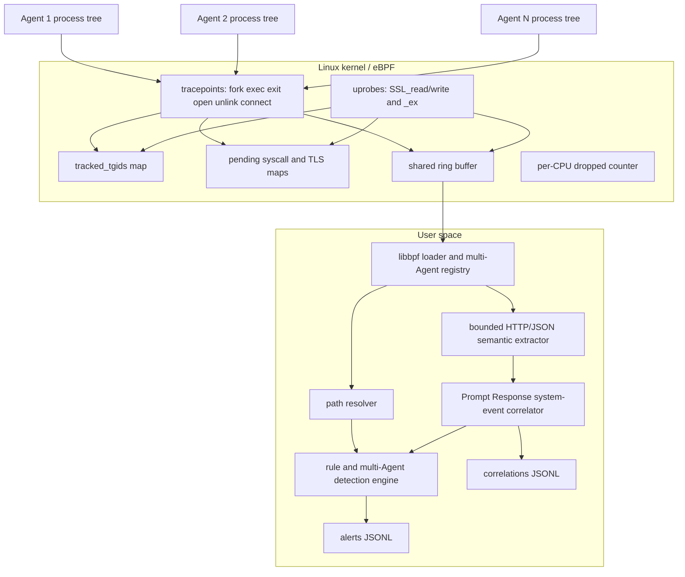
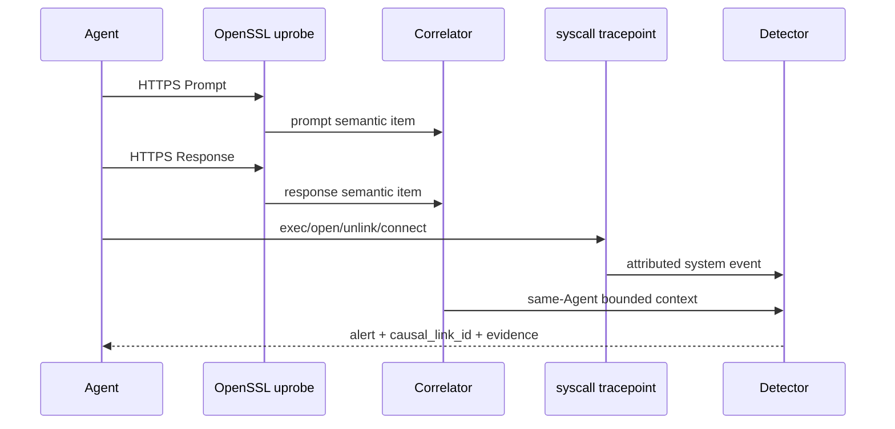

# AgentScope-eBPF 设计说明

## 1. 目标与原则

系统面向第 32 题的三个核心任务：多层级非侵入式采集、多智能体异常识别、
跨层归因告警。设计遵循四条原则：

1. 内核态只负责归属过滤和必要字段读取，复杂规则全部留在用户态；
2. 任何高危结论必须携带 Agent、PID/TID、时间和操作对象；
3. 时间关联是证据而不是绝对因果，日志明确标记证据模型；
4. 所有状态都有 Map 容量、时间窗口、条数或字节上限。

## 2. 架构

## 3. 进程归属与多 Agent 隔离

加载器把每个 `ID:PID` 写入 `tracked_tgids`。`sched_process_fork` 读取父进程的
Agent ID 并传递给子进程，`sched_process_exit` 在进程组主线程退出时清理映射。
所有文件、网络和 TLS 探针在读取参数前查询此 Map；未注册进程不会分配
Ring Buffer 事件。这样既避免多 Agent 事件混淆，也把无关系统噪声挡在内核态。

## 4. 事件 ABI 与低开销传输

统一事件头包含单调时钟、Agent ID、TGID/TID、PPID、UID/GID、类型、路径、
网络端点和系统调用结果。普通事件仅预留到 `data` 字段偏移的固定头部；TLS
事件才预留额外 256 字节明文区。这避免为了少量 TLS 事件让每一次 `openat` 都
复制 256 字节无关负载。

系统调用入口把用户指针中的参数复制到按 PID/TID 索引的 pending Map，出口
结合返回值发出完整事件并删除 pending 状态。Ring Buffer 无空间时只增加
Per-CPU 丢弃计数，不阻塞目标 Agent。

## 5. OpenSSL 明文链路

加载器依次为 `SSL_read`、`SSL_write`、`SSL_read_ex`、`SSL_write_ex` 挂载入口
和返回探针。入口保存缓冲区、请求长度和 `_ex` 的实际长度指针；返回探针只在
调用成功时复制真实字节数。事件继续受 `tracked_tgids` 过滤。

用户态按 `(agent_id, pid, direction)` 设置 256 KiB 有界缓冲，重组
`Content-Length` HTTP 消息，也可从流式片段中扫描完整 JSON 对象。语义提取
覆盖常见 LLM 请求和响应结构。授权头、Cookie、Bearer Token、API Key 以及
对应 JSON 字段在进入历史和日志前脱敏。

## 6. 异常模型

| 类别 | 判定证据 | 结果 |
|---|---|---|
| 非预期 Shell | 成功 exec 路径命中解释器集合 | `unexpected_shell` |
| 敏感文件 | 成功文件操作命中路径/通配规则 | `sensitive_file_access` |
| 工作区越界 | 成功删除且真实路径不在 Agent 工作区 | `workspace_boundary_violation` |
| 逻辑死循环 | Prompt、文件、网络、进程四类中至少两类重复越阈值 | `infinite_loop` |
| 资源滥用 | 有界窗口内进程事件或成功删除过多 | `resource_abuse` / `excessive_file_deletion` |
| 网络风险 | 目标 IP 或端口命中规则 | `malicious_destination` / `high_risk_network_port` |
| 资源竞争 | 不同 Agent 在短窗口写同一规范化路径 | `resource_contention` |
| 未授权传递 | Agent B 读取 Agent A 刚写入的非共享资源 | `unauthorized_agent_handoff` |
| 集体 API 风暴 | 至少两个 Agent 对同一端点的总连接数越阈值 | `collective_api_storm` |

文件竞争是强资源共现证据，但并不等同于真实 IPC；告警不会把它描述为已确认
通信。允许协作对和共享路径会抑制未授权传递告警，但不会掩盖真实写竞争。

## 7. 跨层关联

每个语义项包含唯一 ID、方向、脱敏文本、Agent、PID 和单调时间。系统事件只
关联同一 Agent 且发生在配置时间窗内的最近 Prompt，并选择该 Prompt 之后、
系统事件之前的最近 Response。告警和 correlation 记录都包含
`same-agent bounded temporal correlation`，避免把时间邻近夸大为形式化因果。

## 8. 兼容性与降级

- 缺少单个 syscall tracepoint 时，加载器只禁用该入口/出口对，其余能力继续；
- 找不到 OpenSSL 或使用 `--no-tls` 时，系统级采集和非语义规则不受影响；
- 目标若使用 BoringSSL、rustls、静态 OpenSSL 或 HTTP/3，需要添加对应库探针；
- 相对路径无法从 `/proc` 解析时保留原值，不凭空构造绝对路径；
- 当前实现针对 64 位 Linux，已经在 ARM64 Ubuntu 24.04 完成全量编译。

## 9. 安全与资源边界

- eBPF 程序不修改目标进程或内核数据；
- 明文只对注册 Agent 生效，日志前执行凭据脱敏；
- BPF Map 最大项数固定，用户态队列按 TTL、窗口或 `maxlen` 淘汰；
- 演示只在 `/tmp` 下创建和删除文件；
- JSON 输出对控制字符与非 ASCII 原始字节使用 `\u00xx` 转义。

## 10. 性能口径

`tools/performance_eval.py` 使用真实 BPF 加载、字段读取、Ring Buffer 输出、原生
ABI 校验和逐事件消费路径；关闭不属于采集子系统的 JSON 格式化、关联、检测
与日志，但不以“只加载不消费”冒充采集性能。每种场景
至少 10 组相邻配对、交替顺序，报告配对中位数和单侧 95% bootstrap 上界，
同时要求实收事件达到理论下限、丢弃和非法 ABI 为零。正式代表性负载把固定
批量的真实工具操作与固定轮数 PBKDF2 本地规划计算组合，计时区间没有 sleep，
并将目标与监控器绑定到不同 vCPU；`stress` 模式另行披露纯系统调用最坏情况。
最终机器的报告才是可提交证据。
